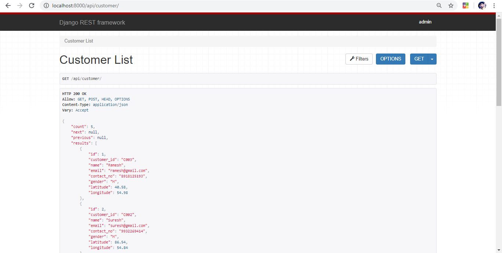
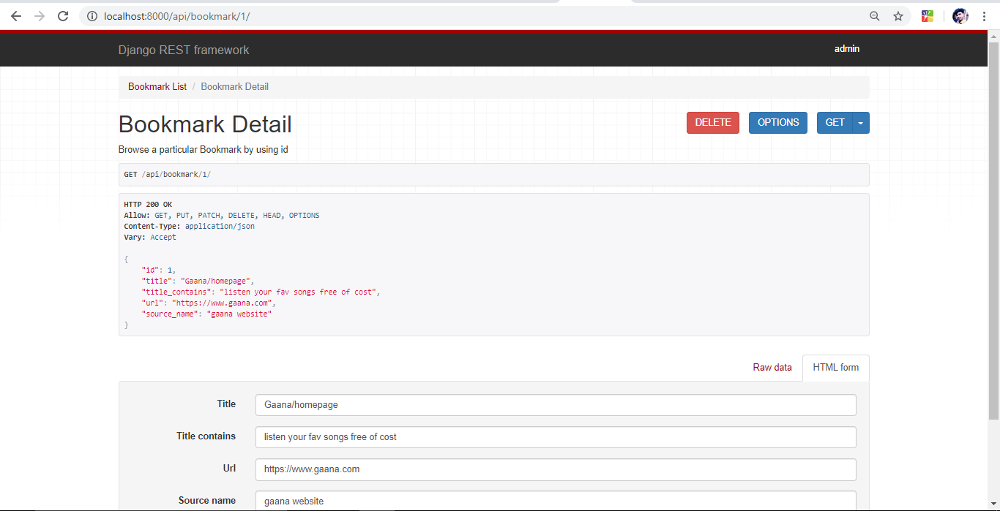

# Bookmark-Manager

## If you want to run this project in your system please follow the steps below :

1. Clone this project 
2. Create a virtual environment
3. Run the Requirements.txt (pip install -r requirements.txt)
4. Run the migrations
5. create superuser for accessing admin panel
6. Run the Django Server
7. Follow the listed Url for accessing the Project Properly . 

	- endpoint which allows storing of any Customer's bookmark
		- http://localhost:8000/api/create/

	- Endpoint which allows browsing and filtration of API endpoint with the following query parameters: 
	customer_id, latitude, longitude, source_name, title_contains etc.
		- http://localhost:8000/api/browse/

	- Endpoint which allows storing Customer.
		- http://localhost:8000/api/customer/

	- Endpoint which allows Detail and List view of all customer and can perform Update and delete operation.
		- http://localhost:8000/api/customer/1/

	- Endpoint which allows storing Bookmark .
		- http://localhost:8000/api/bookmark/

	- Endpoint which allows Detail and List view of all customer and can perform Update and delete operation.
		- http://localhost:8000/api/bookmark/1/

* `You can check filtering functionality by clicking Filter Button`
* `You can also check searching functionality by clicking Search bar `

###### I am sure all functions will be working properly.

### You can use any Browser .

##### For Create Bookmark :- http://localhost:8000/api/create/

###### Screenshot

 

##### For Browse Bookmark  :
- http://localhost:8000/api/browse/

###### Screenshot

 

##### For create and listing all Customer   :
- http://localhost:8000/api/customer/

###### Screenshot

 

##### For Retrieve, Update, PartialUpdate and Delete Customer :
- http://localhost:8000/api/customer/1/

###### Screenshot

 

##### For create and listing all Bookmark   :
- http://localhost:8000/api/bookmark/

###### Screenshot

 

##### For Retrieve, Update, PartialUpdate and Delete Bookmark :
- http://localhost:8000/api/bookmark/1/ 

###### Screenshot

 

